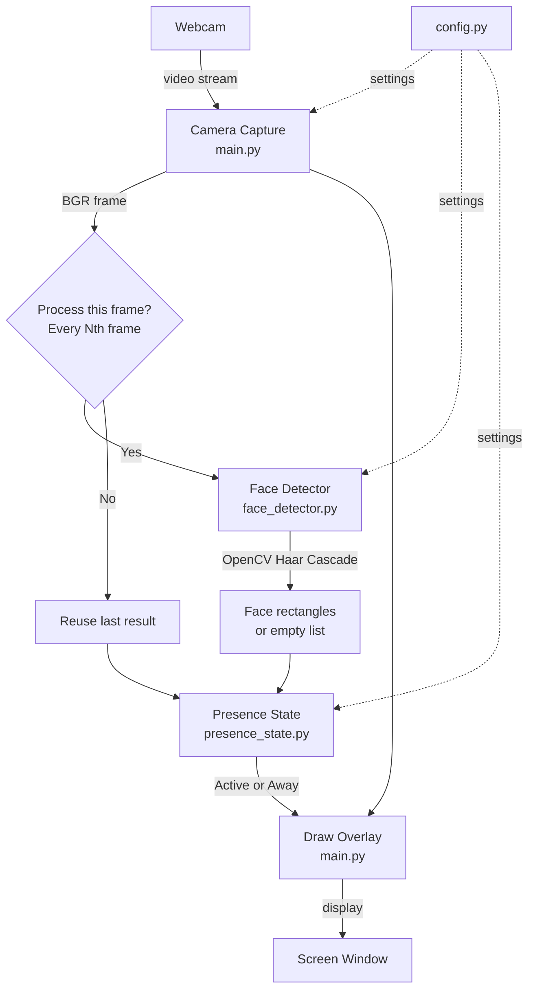

# Face Presence Detection — Architecture

This document explains how the project is structured, how data flows through the system, and why each part exists.

---

## 1. Overview

This project answers one simple question:

> **Is there a face in front of the camera right now?**

Based on that answer, the system reports one of two states:

| State   | Meaning                                      |
|---------|----------------------------------------------|
| Active  | A face was recently detected in the camera   |
| Away    | No face has been detected for a short period |

The project uses **OpenCV** (Open Source Computer Vision Library) to capture webcam frames and detect faces. It does **not** identify *who* the person is — only whether *a* face is present.

---

## 2. High-Level Architecture

The system has four main layers:

```
┌─────────────────────────────────────────────────────────────┐
│                     User / Webcam                           │
└──────────────────────────┬──────────────────────────────────┘
                           │ video frames
                           ▼
┌─────────────────────────────────────────────────────────────┐
│              Camera Capture  (main.py)                      │
│         Reads frames from the webcam continuously           │
└──────────────────────────┬──────────────────────────────────┘
                           │ BGR frame (image)
                           ▼
┌─────────────────────────────────────────────────────────────┐
│           Face Detector  (face_detector.py)                 │
│    Converts frame → detects face rectangles using OpenCV    │
└──────────────────────────┬──────────────────────────────────┘
                           │ face found? (yes/no)
                           ▼
┌─────────────────────────────────────────────────────────────┐
│         Presence State  (presence_state.py)                 │
│      Decides Active or Away using a simple timeout rule     │
└──────────────────────────┬──────────────────────────────────┘
                           │ Active / Away
                           ▼
┌─────────────────────────────────────────────────────────────┐
│              Display  (main.py)                             │
│   Draws face boxes + status label on screen                 │
└─────────────────────────────────────────────────────────────┘
```

---

## 3. Architecture Diagram (Mermaid)



---

## 4. Project Structure

```
Face Detection/
├── main.py              # Entry point — camera loop, display, start/stop
├── face_detector.py     # OpenCV face detection logic
├── presence_state.py    # Active / Away state management
├── config.py            # All adjustable settings in one place
├── requirements.txt     # Python dependencies
├── ARCHITECTURE.md      # This file
└── IMPLEMENTATION.md    # Detailed code walkthrough
```

---

## 5. Main Components

### 5.1 `config.py` — Settings

**Why it exists:** Keeps all numbers and settings in one file so they are easy to find and change without touching the main logic.

**Input:** None (static values)

**Output:** Constants used by other modules

| Setting                  | Default | Purpose                                      |
|--------------------------|---------|----------------------------------------------|
| `CAMERA_INDEX`           | 0       | Which webcam to use                          |
| `PROCESS_EVERY_N_FRAMES` | 2       | Run detection every 2nd frame (saves CPU)    |
| `SCALE_FACTOR`           | 1.1     | How much to shrink the image at each scan step |
| `MIN_NEIGHBORS`          | 5       | How strict the detector is                   |
| `MIN_FACE_SIZE`          | (60,60) | Ignore very small detections (likely noise)  |
| `AWAY_TIMEOUT_SECONDS`   | 2.0     | Seconds without a face before going Away     |

---

### 5.2 `main.py` — Application Entry Point

**Why it exists:** Ties everything together. It opens the camera, runs the loop, calls detection, updates state, and shows the result.

**Input:** Webcam video stream

**Output:** Live window showing face boxes and Active/Away status

**Key responsibilities:**
- Open and close the camera safely
- Read frames in a continuous loop
- Call the face detector on selected frames
- Update presence state
- Draw results on screen
- Handle quit (press `q` or `ESC`)

---

### 5.3 `face_detector.py` — Face Detection

**Why it exists:** Separates the "find a face" logic from everything else. This makes the code easier to read and test.

**Input:** One camera frame (color image as a NumPy array)

**Output:** List of face rectangles — each rectangle is `(x, y, width, height)`

**How OpenCV is used:**
1. Load the pre-trained **Haar Cascade** model (`haarcascade_frontalface_default.xml`)
2. Convert the color frame to **grayscale** (detection works on gray images)
3. Apply **histogram equalization** to improve contrast in poor lighting
4. Run `detectMultiScale()` to scan the image and return face locations

---

### 5.4 `presence_state.py` — Active / Away Logic

**Why it exists:** A single detected frame does not always mean the user is truly active (and a single missed frame does not mean they left). This module adds a simple **timeout rule** to make the status stable.

**Input:** Boolean — `True` if a face was detected, `False` if not

**Output:** Current state string — `"Active"` or `"Away"`

**Decision rule:**

```
IF face detected NOW:
    → Active immediately

ELSE IF no face has EVER been seen:
    → Away

ELSE IF time since last face > AWAY_TIMEOUT_SECONDS (2 seconds):
    → Away

ELSE:
    → Stay Active (grace period — user may have blinked or turned slightly)
```

---

## 6. Camera Input Flow

Step-by-step path of one frame through the system:

```
1. Webcam captures light → digital image (frame)
2. main.py reads frame using cv2.VideoCapture.read()
3. Frame is a NumPy array in BGR color format (Blue-Green-Red)
4. Every 2nd frame is sent to FaceDetector.detect()
5. FaceDetector converts BGR → grayscale
6. OpenCV scans the grayscale image for face-like patterns
7. If faces found → list of rectangles returned
8. presence.update(True/False) is called
9. main.py draws green boxes around faces + status text
10. Frame is shown in a window using cv2.imshow()
11. Loop repeats (~30 times per second)
```

---

## 7. Face Detection Flow

```
Color Frame (BGR)
       │
       ▼
Convert to Grayscale
       │
       ▼
Histogram Equalization  ← improves contrast
       │
       ▼
Haar Cascade Classifier
  (detectMultiScale)
       │
       ├── Face pattern found → return (x, y, w, h)
       └── No pattern found  → return empty list
```

**What is Haar Cascade?**
A classic, lightweight face detection method built into OpenCV. It looks for simple patterns (like the dark eye region between lighter cheeks) at different sizes across the image. It is fast and needs no internet or GPU.

---

## 8. Active / Away Decision Flow

```
Face detected?
    │
    ├── YES → set state = Active, record current time
    │
    └── NO  → check: how long since last face seen?
                  │
                  ├── Less than 2 seconds → keep Active
                  └── 2+ seconds          → set Away
```

This **2-second grace period** prevents the status from flickering when the user blinks, moves slightly, or when detection misses a frame.

---

## 9. Important Functions Summary

| Function / Method       | File               | Input              | Output           |
|-------------------------|--------------------|--------------------|------------------|
| `run()`                 | main.py            | None               | Runs the app     |
| `open_camera()`         | main.py            | Camera index       | Camera object    |
| `draw_overlay()`        | main.py            | Frame, faces, state| Annotated frame  |
| `FaceDetector.detect()` | face_detector.py   | BGR frame          | Face rectangles  |
| `PresenceState.update()`| presence_state.py  | face_detected bool | Active / Away    |

---

## 10. Start and Stop Behavior

**Start:**
```
python main.py
→ Opens camera
→ Loads Haar Cascade model
→ Shows live window
```

**Stop:**
```
Press 'q' or ESC
→ Loop exits
→ Camera is released (camera.release())
→ All windows closed (cv2.destroyAllWindows())
→ Program exits cleanly
```

The `finally` block in `run()` ensures the camera is always released, even if an error occurs.

---

## 11. Why This Design?

| Design Choice                        | Reason                                              |
|--------------------------------------|-----------------------------------------------------|
| Separate files per responsibility    | Easy to read, explain, and modify one part at a time |
| Haar Cascade (not deep learning)     | Built into OpenCV, no extra downloads, fast on CPU   |
| Grayscale + histogram equalization   | Faster processing, better results in uneven lighting |
| Process every Nth frame              | Reduces CPU usage without hurting responsiveness    |
| Timeout-based Away state             | Prevents flickering from brief detection gaps       |
| Central config file                  | All tuning knobs in one visible place               |

---

## 12. What This Project Does NOT Do

- Does not identify *who* the person is (no face recognition)
- Does not save or upload images
- Does not run in the background as a service
- Does not use GPU or neural networks
- Does not handle multiple users or sessions

These are intentional — the goal is a simple, explainable presence check.

---

## 13. Potential Interview Questions & Answers

### Why OpenCV?

OpenCV is a widely used, free computer vision library with built-in face detection. It works on a normal CPU, needs no GPU, and has good Python support. It is a practical choice for a simple presence check.

### Why Haar Cascade instead of a deep learning model?

Haar Cascade is included with OpenCV, requires no extra model download, runs fast on CPU, and is easy to explain. Deep learning models (like MTCNN or YuNet) can be more accurate but add complexity that is not needed for a basic Active/Away check.

### How does the system decide Active vs Away?

If a face is detected, status becomes Active immediately. If no face is detected for 2 continuous seconds, status becomes Away. The 2-second delay prevents flickering.

### What happens if multiple faces are detected?

The system treats any face as "present." If at least one face is found, the user is Active. For a single-user session monitor, this is the correct behavior.

### What happens if the face moves?

As long as the face stays visible to the camera, detection continues and status stays Active. Large or fast movements may cause brief missed frames, but the 2-second timeout covers those gaps.

### What happens in low light?

Detection may become less reliable. Histogram equalization helps somewhat, but very dark conditions can cause missed detections. Better lighting or a higher-quality camera improves results.

### Why not process every frame?

Face detection is the most expensive step. Processing every 2nd frame roughly halves CPU usage while the 2-second Away timeout keeps the status stable.

### How could this integrate into a larger application?

The `PresenceState` class can expose its `.state` property to any other module. A web app could poll it via an API; a desktop app could listen for state changes and pause timers or send notifications.

### Face detection vs face recognition?

**Detection** = "Is there a face?" (this project). **Recognition** = "Whose face is it?" (not needed here). Presence monitoring only needs to know if someone is there.

### Security / privacy considerations?

The camera feed is processed locally in memory. No images are saved or sent anywhere. In a production app, users should be informed that the camera is in use and given a way to disable monitoring.

---

## 14. Challenges and Solutions

### False face detections (detecting a face where there isn't one)

**Problem:** Haar Cascade may detect face-like patterns in posters, photos, or busy backgrounds.

**Why it happens:** The classifier looks for general patterns (dark eyes, light cheeks), not a specific person.

**Simple solution:** Increase `MIN_NEIGHBORS` (e.g., from 5 to 7) and set a minimum face size with `MIN_FACE_SIZE`.

**Why it works:** Higher `MIN_NEIGHBORS` requires more overlapping detections before accepting a result, filtering out weak false matches.

---

### Missed detections (face is there but not detected)

**Problem:** User is present but status switches to Away.

**Why it happens:** Poor lighting, face turned away, or face too small/far from camera.

**Simple solution:** Use the 2-second Away timeout so brief misses do not change status. Improve lighting and camera angle.

**Why it works:** The timeout acts as a buffer. One or two missed frames over 2 seconds will not trigger Away.

---

### Poor lighting

**Problem:** Detection fails in dark or backlit conditions.

**Why it happens:** Haar Cascade relies on contrast between facial features. Low contrast makes patterns hard to find.

**Simple solution:** Histogram equalization (already applied in code). Additionally, ask the user to face a light source.

**Why it works:** Equalization spreads out pixel brightness values, making dark features more visible.

---

### Camera positioning

**Problem:** Face is cut off or too far from the camera.

**Why it happens:** User sits outside the camera's field of view or too far away.

**Simple solution:** Position the camera at eye level, arm's length away, facing the user directly.

**Why it works:** Frontal face detection works best when the full face is visible and reasonably sized in the frame.

---

### Face movement

**Problem:** Status flickers when the user moves their head.

**Why it happens:** Movement can blur the frame or temporarily hide facial features from the detector.

**Simple solution:** The 2-second Away timeout and processing every 2nd frame (not every frame) together absorb brief movement gaps.

**Why it works:** The system does not react to a single missed detection — it waits for a sustained absence.

---

### Processing every frame is expensive

**Problem:** Running detection on every frame at 30 FPS uses significant CPU.

**Why it happens:** `detectMultiScale()` scans the image at multiple scales — computationally heavy.

**Simple solution:** Set `PROCESS_EVERY_N_FRAMES = 2` to detect on every other frame.

**Why it works:** At 30 FPS, detecting 15 times per second is still more than enough for a 2-second timeout window.

---

### Temporary detection failures

**Problem:** User blinks or looks down briefly and status flickers to Away.

**Why it happens:** A blink lasts ~300 ms — one or two frames may have no detectable face.

**Simple solution:** The `AWAY_TIMEOUT_SECONDS = 2.0` grace period.

**Why it works:** Blinks and brief glances are well under 2 seconds, so status stays Active.

---

### Camera access problems

**Problem:** Program exits with "Could not open the camera."

**Why it happens:** No webcam connected, camera in use by another app (Zoom, Teams), or wrong `CAMERA_INDEX`.

**Simple solution:** `open_camera()` checks both `isOpened()` and reads a test frame. Try `CAMERA_INDEX = 1` if index 0 fails. Close other apps using the camera.

**Why it works:** Verifying a readable frame confirms the camera is truly accessible, not just "open."
